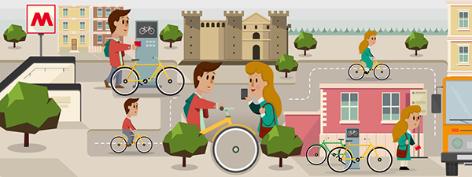

# Cyclistic Bike-Share Marketing Analysis

**IMPORTANT** : The analysis on GitHub doesn't output everything correctly, please refer to [**this version on Kaggle**](https://www.kaggle.com/code/fabio98/exploratory-data-analysis-in-r).

  
  

## Introduction
In 2016, Cyclistic launched a successful bike-share offering. Since then, the program has grown to a fleet of 5,824 bicycles that are geotracked and locked into a network of 692 stations across Chicago. The bikes can be unlocked from one station and returned to any other station in the system anytime.

Until now, Cyclistic’s marketing strategy relied on building general awareness and appealing to broad consumer segments. One approach that helped make these things possible was the flexibility of its pricing plans: single-ride passes, full-day passes, and annual memberships. Customers who purchase single-ride or full-day passes are referred to as casual riders. Customers who purchase annual memberships are Cyclistic members.

Cyclistic’s finance analysts have concluded that annual members are much more profitable than casual riders. Although the pricing flexibility helps Cyclistic attract more customers, the company believes that maximizing the number of annual members will be key to future growth. 

## Scenario
In this case my role as a Junior Data Analyst working in the marketing analysis team at Cyclistic was to understand how casual riders and annual members use Cyclistic bikes differently. From these insights the marketing team would design a strategy with the goal of converting casual riders into annual members. 

## Business Task
The purpose of this script is to consolidate downloaded Divvy data into a single dataframe and then conduct an exploratory analysis to help answer the key question: **“In what ways do members and casual riders use Divvy bikes differently?”**

## Key Stakeholders
**Cyclistic** : A Chicago-based bike-share program.  
**Lily Moreno** : Director of marketing and manager for Cyclistic.  
**Cyclistic marketing analytics team** : A team of data analysts who are responsible for collecting, analyzing and reporting data that helps guide Cyclistic marketing strategy.  
**Cyclistic executive team** : The team that decides whether to approve the recommended marketing program.  

## Limitations
One limitation for this project was the absence of riders' personally identifiable information due to privacy reasons. Cyclistic was therefore precluded from connecting pass purchases to individuals. Linking credit card numbers to unique IDs could have helped segmenting users based on information such as their home address and whether or not they live in a zone where the service was provided. The major drawback of not having these information was the impossibility to determine whether a consumer bought multiple or repeated passes, to further understand how the average user and member differed in their usage.
